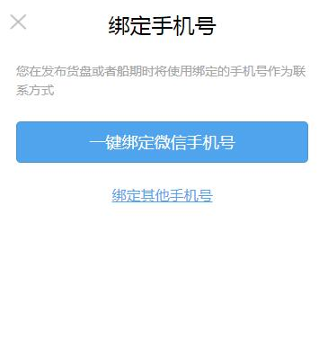

# 绑定手机号

> 包含一键绑定微信手机号和自定义手机号绑定

## 示例


## 参数
|  字段   | 默认值  |  类型  | 说明 |
|  ----  | ----  |  ----  | ----  |
| isShow  | false | Boolean | 是否展示  |

## 事件
|  事件名   | 参数  |  类型  | 说明 |
|  ----  | ----  |  ----  | ----  |
| bindphonesuccess  | - | - | 完成绑定  |

## 示例用法

```json
{
	"usingComponents": {
		"c-bind-phone": "../bindPhoneNumber/bindPhoneNumber"
	}
}
```

```wxml
<c-bind-phone is-show="{{bindPhoneNumberPanelShow}}" bind:bindphonesuccess="bindPhoneSuccess"></c-bind-phone>

```

```js
Component({
    data: {
		bindPhoneNumberPanelShow: false,
	},
    showModal:()=>{
        this.setData({
            bindPhoneNumberPanelShow: true,
        })
    },
    bindPhoneSuccess:()=>{
        //todo...
    }
})
```
