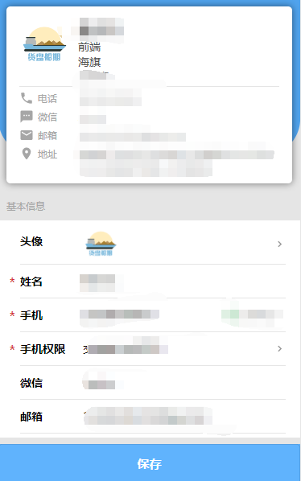

# 底部蓝色按钮

> 此内部封装了一个微信小程序原生的button

## 示例


## 参数
|  字段   | 默认值  |  类型  | 说明 |
|  ----  | ----  |  ----  | ----  |
| loading  | false | Boolean | 是否显示正在加载的小圈，**这个值为true时，disable的值也为true，这个值为false时，disable的值也为false**  |
| coverView  | false | Boolean | 是否用cover-view包裹button |
| zIdx  | 10 | Number | button的z-index值 |


## 插槽
|  名字    | 说明 |
|  ----  |  ----  |
| 默认插槽  |  -  |

## 示例用法
> 已经注册为全局组件，无需再在页面中单独引用

```wxml
<c-bottom-btn catchtap="btnClick" loading="{{bottomBtnLoading}}" coverView="true">
	保存
</c-bottom-btn>
```

```js
Page({
    data:{
        bottomBtnLoading:false
    },
	btnClick(){
        this.setData({
            bottomBtnLoading:true
        })
        setTimeout(()=>{
            this.setData({
                bottomBtnLoading:false
            })
        },1000)
    }
})
```
