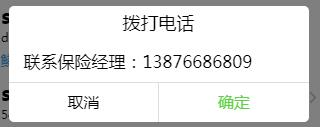
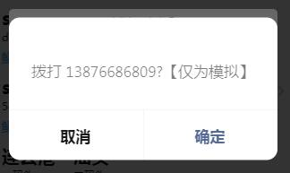

# 联系保险经理

> 之前点击购买保险都是直接跳转购买页面，现在暂时关闭线上购买通道，弹窗“请联系保险经理”

## 示例



## 参数
|  字段   | 默认值  |  类型  | 说明 |
|  ----  | ----  |  ----  | ----  |
| isShowPopUp  | false | Boolean | 是否展示  |

## 事件
|  事件名   | 携带参数  |  类型  | 说明 |
|  ----  | ----  |  ----  | ----  |
| closepopup  | - | - | 关闭弹窗  |

## 示例用法

```json
{
	"usingComponents": {
		"c-call-insurance":"../component/callInsurance/callInsurance"
	}
}
```

```wxml
<c-call-insurance isShowPopUp="{{callInsurance}}" bind:closepopup='hideCallInsurance'></c-call-insurance>

```

```js
Page({
    data: {
		callInsurance:false
	},
    showCallInsurance:function(){
        this.setData({
            callInsurance: true
        })
    },
	hideCallInsurance(){
		this.setData({
			callInsurance: false
		})
	},
})
```
