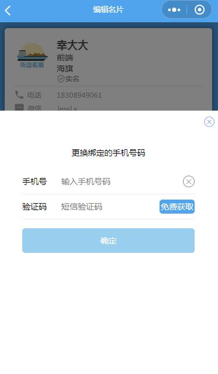

# 更改绑定手机号

## 示例


## 事件
|  事件名   | 携带参数  |  类型  | 说明 |
|  ----  | ----  |  ----  | ----  |
| changePhoneDone  | {phoneNumber} | String | 完成更改绑定手机号  |

## 插槽
|  名字    | 说明 |默认值|
|  ----  |  ----  |----|
| -  |  展示的样式  |"更换绑定电话"|

## 示例用法

```json
{
	"usingComponents": {
		"c-change-phone-number": "../../component/changePhoneNumber/changePhoneNumber"
	}
}
```

```wxml
<c-change-phone-number bind:changePhoneDone="changePhoneDone">
    {{phoneNumber}}
</c-change-phone-number>

```

```js
Page({
	changePhoneDone(){
		this.setData({
            phoneNumber:e.detail.phoneNumber
        })
	},
})
```
