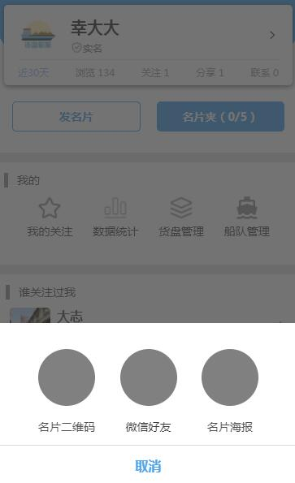

# 选择分享名片的方式

## 示例


## 事件
|  事件名   | 携带参数  | 说明 |
|  ----  | ----  | ----  |
| closed  | -|  关闭modal |

## 插槽
|  名字    | 说明 |默认值|
|  ----  |  ----  |----|
| -  |  展示的样式  |空|

## 示例用法

```json
{
	"usingComponents": {
		"c-choose-share-card-type":"../component/chooseShareCardType/chooseShareCardType"
	}
}
```

```wxml
<c-choose-share-card-type bind:closed="modalClosed">发名片</c-choose-share-card-type>
```

```js
Page({
	modalClosed(){
		//todo..
	},
})
```
