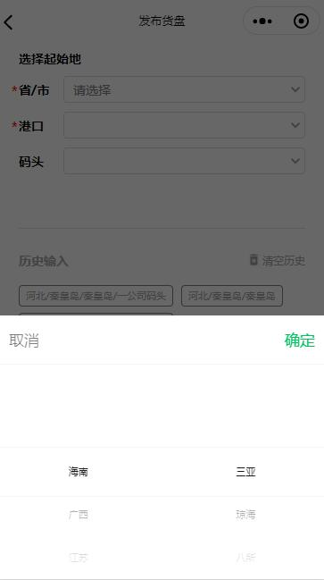

# 省市联动选择

> 根据业务要求，此处只有沿海城市的选择


## 示例



## 事件
|  事件名   | 参数  |  类型  | 说明 |
|  ----  | ----  |  ----  | ----  |
| selectDone  | provinceId| Number | 省Id  |
|             | cityId | Number | 市Id  |


## 示例用法

```json
{
	"usingComponents": {
        "c-city-pick":"../cityPicker/cityPicker",
	}
}
```

```wxml
<c-city-pick bind:selectDone="citySelectDone" ></c-city-pick>
```

```js
Page({
    citySelectDone(e){
      this.setData({
        provinceId:e.detail.provinceId,
        cityId:e.detail.cityId,
      })
    },
})
```