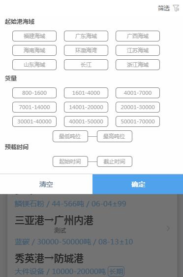

# 货盘筛选项

> 包含起始港海域 货量范围 预载时间


## 示例



## 事件
|  事件名   | 携带参数  |  类型  | 说明 |
|  ----  | ----  |  ----  | ----  |
| selectDone  | startDate | String | 起始日期  |
|             | endDate | String | 截止日期  |
|             | minTon | Number | 最小货量  |
|             | maxTon | Number | 最大货量  |
|             | seaAreaId | Number | 起始港海域Id  |


## 插槽
|  名字    | 说明 |
|  ----  |  ----  |
| 默认插槽  |  点击插槽会打开该modal  |


## 示例用法

```json
{
	"usingComponents": {
        "c-filter-goods": "../component/filterOfGoods/filterOfGoods"
	}
}
```

```wxml
    <c-filter-goods bind:selectDone='filterGoods' bind:closed='closed'>
        <view class="filter">
            <view class="flexBox">
                <text class="lightDark mgr10">筛选</text>
                <image class="smallIcon" src="../../img/filter.png"></image>
            </view>
        </view>
    </c-filter-goods>
```

```js
Page({
    filterGoods(e){
        let filterData=e.detail;
        this.setData({
            "SeaAreaId":filterData.seaAreaId,
            "MinCargo":filterData.minTon,
            "MaxCargo":filterData.maxTon,
            "MinLoadDate":filterData.startDate,
            "MaxLoadDate":filterData.endDate
        })
    },
    closed(){
        //todo..
    }
})
```
