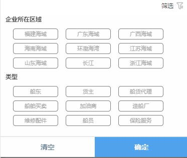

# 货盘筛选项

> 包含企业所在区域 类型


## 示例



## 事件
|  事件名   | 携带参数  |  类型  | 说明 |
|  ----  | ----  |  ----  | ----  |
| selectDone  | ↓ | {} | 选择完成  |
|             | seaAreaId | Number | 海域Id  |
|             | labelId | Number | 类型Id  |


## 插槽
|  名字    | 说明 |
|  ----  |  ----  |
| 默认插槽  |  点击插槽会打开该modal  |


## 示例用法

```json
{
	"usingComponents": {
        "c-filter-person": "../../component/filterOfPerson/filterOfPerson"
	}
}
```

```wxml
<c-filter-person bind:selectDone='searchPersonByFilter'>
    <text>筛选</text>
</c-filter-person>
```

```js
Page({
    searchPersonByFilter(e) {
        this.setData({
            "seaAreaId": e.detail.seaAreaId,
            "labelId": e.detail.labelId,
        })
    },
})
```
