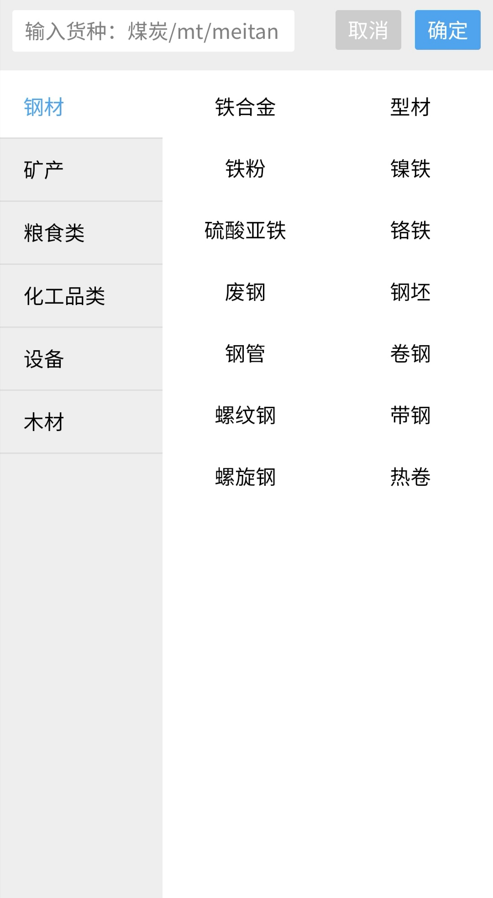

# 货种选择（已淘汰）

> 这是第一个版本的货种选择


## 示例



## 事件
|  事件名   | 携带参数  |  类型  | 说明 |
|  ----     | ----  |  ----  | ----  |
| selectDone   | ↓| Object | 选择完毕  |
|       | name| String| 货名  |
|       | goodsTypeId| String| 货种Id  |

## 插槽
|  名字    | 说明 |
|  ----  |  ----  |
| 默认插槽  |  点击插槽会打开该panel  |

## 示例用法

```json
{
	"usingComponents": {
         "c-goods-select": "../../component/goodsSelect/goodsSelect"
	}
}
```

```wxml
<c-goods-select bind:selectDone="todo"></c-goods-select>
```

```js
Page({
    todo(e){
        
    }
})
```
