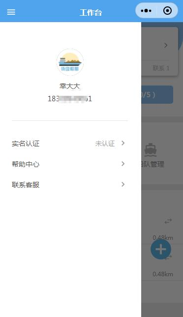

# 左侧菜单栏

> 该组件的顶部标题栏和左上角的样式全部是自定义的

> **bold**


## 示例


## 参数
|  字段   | 默认值  |  类型  | 说明 |
|  ----  | ----  |  ----  | ----  |
| navbarData  | {} | Object |  见下方示例用法 |


## 示例用法

```json
{
	"usingComponents": {
        "c-nav-bar":"../component/navBar/navBar"
	}
}
```

```wxml
<c-nav-bar navbarData="{{navbarData}}"></c-nav-bar>
```

```js
Page({
    data:{
        navbarData: {
            title: '工作台',
            avatar:"",
            userName:"",
            mobilePhone:"",
            isRealName:0
        },
    },
	
})
```
