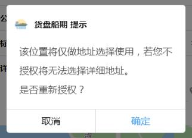
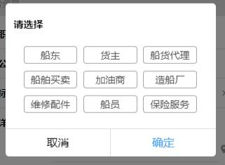
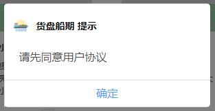

# 弹窗


## 示例
> 默认标题



> 自定义标题



> 只保留确认按钮



## 参数
|  字段   | 默认值  |  类型  | 说明 |
|  ----  | ----  |  ----  | ----  |
| isShowPopUp  | false | Boolean | 是否展示弹窗  |
| isShowFooter  | true | Boolean | 是否展示底部按钮  |
| isShowShadow  | true | Boolean | 是否显示背景灰色蒙层  |
| isShowCancel  | true | Boolean | 是否显示取消键  |
| defaultTitle  | false | Boolean | 是否使用默认标题  |
| cancelText  | "取消" | String | 取消键的文字  |
| sureText  | "确定" | String | 确定键的文字  |


## 事件
|  事件名   | 携带参数  |  类型  | 说明 |
|  ----     | ----  |  ----  | ----  |
| closepopup  | ↓ | Object | 关闭信息  |
|   | confirm | Boolean | 是否点击了确定键  |
|   | shadowClose | Boolean | 是否是点击了遮罩层关闭弹窗  |

## 插槽
|  名字    | 说明 |
|  ----  |  ----  |
| title  |  当defaultTitle为false的时候，title将展示该slot传入的节点  |
| content  |  弹窗内容  |

## 示例用法

```json
{
	"usingComponents": {
        "c-pop-up":"../component/popUp/popUp"
	}
}
```

```wxml
<c-pop-up bind:closepopup="closelabelModal" is-shadow-close="{{true}}" is-show-pop-up="{{isShowLabelModal}}" sureText="确定">
	<view slot="title">自定义标题</view>
	<view slot="content">
		<view>内容</view>
	</view>
</c-pop-up>
<c-pop-up bind:closepopup="closeOpenSettingModal" is-shadow-close="{{true}}" is-show-pop-up="{{isShowOpenSettingModel}}" defaultTitle="{{true}}" sureText="确定">
	<view slot="content" >
		<view>该位置将仅做地址选择使用，若您不授权将无法选择详细地址。</view>
		<view>是否重新授权？</view>
	</view>
</c-pop-up>
```

```js
Page({
    data:{
        isShowLabelModal:false,
        isShowOpenSettingModel:false,
    },
    closelabelModal(e){
        this.setData({
            isShowLabelModal: false
        });
        //todo..
    }
	closeOpenSettingModal(e){
        //点击了确认
        if (e.detail.confirm) {
            wx.openSetting({
                complete: (res) => { },
            })
        }
        this.setData({
            isShowOpenSettingModel: false
        })
    }
})
```
