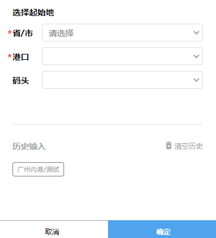

# 选择港口


## 示例



## 事件
|  事件名   | 携带参数  |  类型  | 说明 |
|  ----     | ----  |  ----  | ----  |
| selectDone   | ↓| Object | 选择完成  |
|        | cityId | Number | 城市Id  |
|        | provinceId | Number | 省份Id  |
|        | portId | Number | 港口Id  |
|        | portName | String | 港口名字  |
|        | wharfId | String | 码头Id  |
|        | wharfName | String | 码头名字  |


## 插槽
|  名字    | 说明 |
|  ----  |  ----  |
| 默认插槽  |  点击会打开此panel  |

## 示例用法

```json
{
	"usingComponents": {
        "c-port-select": "../../component/portSelect/portSelect"
	}
}
```

```wxml
<c-port-select bind:selectDone="selectGoodsPort">
    <text >{{portName?(portName+wharfName):"选择目的地"}}</text>
</c-port-select>
```

```js
Page({
    data:{
        portName:"",
        wharfName:"",
    },
	selectGoodsPort(e){

    }
})
```
