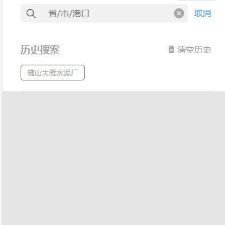

# 货盘列表关键字筛选


## 示例



## 事件
|  事件名   | 携带参数  |  类型  | 说明 |
|  ----     | ----  |  ----  | ----  |
| selectDone  | ↓| object | 选择完成  |
|   | type | Number |  1-省 2-市 3-港 |
|   | id | Number |   |
|   | name | String |   |
| closed  | -| - | 关闭panel  |


## 插槽
|  名字    | 说明 |
|  ----  |  ----  |
| 默认插槽  |  点击会打开搜索关键字的panel  |

## 示例用法

```json
{
	"usingComponents": {
        "c-quick-search-goods":"../component/quickSearchGoods/quickSearchGoods"
	}
}
```

```wxml
<c-quick-search-goods bind:selectDone='keywordSearchGoods' bind:closed='closed'>
    <text >{{keyword}}</text>
</c-quick-search-goods>
```

```js
Page({
    data:{
        keyword:"请搜索"
    },
	keywordSearchGoods(e){
        this.setData({
            keyword:e.detail.name,
            KeyWorkType:e.detail.type,
            KeyWorkId:e.detail.id
        })
    },
    closed(){
        //todo..
    }
})
```
