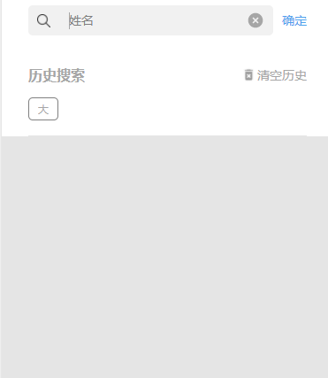

# 好友&名片夹列表关键字筛选


## 示例


## 参数
|  字段   | 默认值  |  类型  | 说明 |
|  ----  | ----  |  ----  | ----  |
| historyType  | '' | String | 存在微信的storage中的key名  |

## 事件
|  事件名   | 携带参数  |  类型  | 说明 |
|  ----     | ----  |  ----  | ----  |
| selectDone  | ↓| object | 选择完成  |
|   | keyword | String |  关键字 |


## 插槽
|  名字    | 说明 |
|  ----  |  ----  |
| 默认插槽  |  点击会打开搜索关键字的panel  |

## 示例用法

```json
{
	"usingComponents": {
        "c-filter-person": "../../component/filterOfPerson/filterOfPerson"
	}
}
```

```wxml
<c-quick-search-person  bind:selectDone='searchPersonByKeyword' historyType="searchHistoryOfCardList">
	<text>{{keyword"}}</text>
</c-quick-search-person>
```

```js
Page({
    data:{
        keyword:"请搜索"
    },
	searchPersonByKeyword(e){
        this.setData({
            keyword:e.detail.keyword,
        })
    }
})
```
