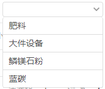

# 下拉框（远程搜索）

> 扩展性有限，仅适用于带参数的远程搜索


## 示例


## 参数
|  字段   | 默认值  |  类型  | 说明 |
|  ----  | ----  |  ----  | ----  |
| url  | '' | String | 远程搜索的url  |
| filter  | '' | Function | 通过该方法过滤远程返回的数据  |
| uploadData  | {} | Object | 要传给接口的参数  |
| placeholder  | '' | String | 占位符  |
| icon  | '' | String | 搜索框Icon，不传则没有icon展示  |

## 事件
|  事件名   | 携带参数  |  类型  | 说明 |
|  ----     | ----  |  ----  | ----  |
| selectDone | ↓| {} | 选中  |
|  | id| Number | 被选中的id  |
|  | name | String | 被选中的Name  |


## 示例用法

```json
{
	"usingComponents": {
         "c-select": "../../component/select/select"
	}
}
```

```wxml
<c-select  bind:selectDone="selectDone" url="{{url}}" filter="{{filter}}" uploadData="{{uploadData}}"></c-select>
```

```js
var common = require('../../../utils/common.js');
const goodsFilter={
  fun:(data)=>{
    let str=JSON.stringify(data.retData).replace(/commodityName/g,'name');
    return JSON.parse(str);
  }
}
Page({
    data:{
        url:common.commonUrl+"Common/QueryCommodityInfo",
        uploadData:{},
        filter:goodsFilter,
        goodsName:"",
        goodsTypeId:"",
    },
	selectDone(){
        this.setData({
            goodsName: e.detail.name,
            goodsTypeId: e.detail.id
        });
    }
})
```
