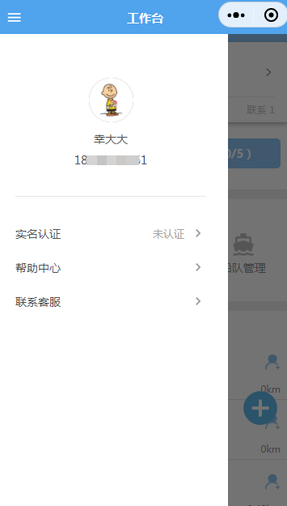

# 侧边弹出框


## 示例


## 参数
|  字段   | 默认值  |  类型  | 说明 |
|  ----  | ----  |  ----  | ----  |
| isShow  | false | Boolean | 是否打开侧边弹出层  |
| orientation  | "right" | String | 位置left/right  |
| width  | "600" | String | 弹出层宽度  |


## 事件
|  事件名   | 携带参数  |  类型  | 说明 |
|  ----     | ----  |  ----  | ----  |
| closed | -| - | 弹窗关闭  |

## 插槽
|  名字    | 说明 |
|  ----  |  ----  |
| 默认插槽  |  -  |

## 示例用法

```json
{
	"usingComponents": {
        "c-side-pop-panel":"../sidePopPanel/sidePopPanel"
	}
}
```

```wxml
<c-side-pop-panel>content</c-side-pop-panel>
```


