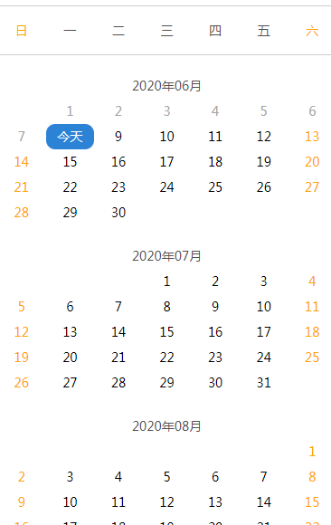

# 日期选择

> 全屏日期选择，只支持选择今天开始之后的日期


## 示例


## 参数
|  字段   | 默认值  |  类型  | 说明 |
|  ----  | ----  |  ----  | ----  |
| rangeMonth  | 13 | Number | 展示rangeMonth个月的日期  |


## 事件
|  事件名   | 携带参数  |  类型  | 说明 |
|  ----     | ----  |  ----  | ----  |
| selectDone      | date| String | 选中的日期，如：“2020/06/25”  |

## 插槽
|  名字    | 说明 |
|  ----  |  ----  |
| 默认插槽  |  点击会打开日期选择组件  |

## 示例用法

```json
{
	"usingComponents": {
        "c-time-select": "../../component/timeSelect/timeSelect"
	}
}
```

```wxml
<c-time-select bind:selectDone="selectDate" range-month='3'>
	<text>{{loadDate?loadDate:"请选择"}}</text>
</c-time-select>
```

```js
Page({
    data:{
        loadDate:"",
    },
	selectLoadDate(e) {
        this.setData({
          loadDate: e.detail.date
        });
    },
})
```
